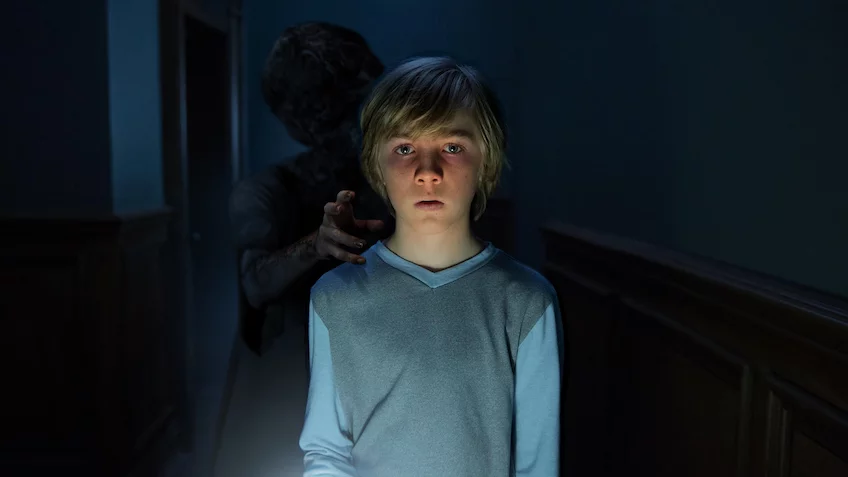

&nbsp;&nbsp;&nbsp;_still from Netflix_

Eli is the newest in the batch of Original Horrors it has been pumping out the last few years.

The movie follows its namesake (Charlie Shotwell): a young boy who apparently suffers from a genetic disorder which causes him to break out and have trouble breathing when exposed to the outdoors. His mother and father (Kelly Reilly and Max Martini) are taking him to a doctor (Lili Taylor) who is supposed to treat his illness and hopefully cure it. While staying in the very The Haunting of Hill House-esque mansion, Eli is haunted by several specters. Visited also by a girl (Sadie Sink) who has visited with some of the other patients that have come to the house under similar conditions, Eli tries to figure out what apparent underlying secrets there are with this house and the doctor who operates out of it, as well as with the apparitions haunting him.

While watching _Eli_ I felt like it had some promise. Most recent horror movies are just copycats, simply recycling the same themes and plots from previous horror movies. Unfortunately, Ciaran Hoy's _Eli_ did not end up being an exception to the rule. It did hold my interest for the first half, but then it falls flat. Satisfaction for all of the questions that are raised while watching the movie doesn't come until the movie is almost over and what you're left with is an empty twist that is not unique and almost feels like a copout.

This movie has been done before and it has been done better.
