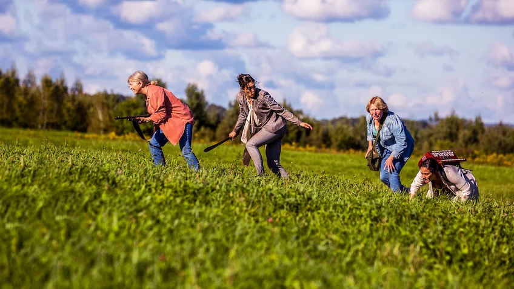

&nbsp;&nbsp;&nbsp;_still from Netflix_

Robin Aubert's _Ravenous_ is a French (language) Canadian Zombie movie taking place in a small town in Quebec.

The movie itself is refreshing. At points _Ravenous_ is funny, suspenseful, scary, and sometimes just strange. Bonin (Marc-André Grondin) is barely our main character who we follow as he drives his truck around the rural countryside. Several other strong characters are established, and all of them have the unified goal of survival, you can strongly feel the different backgrounds of the characters as they all come together.

Céline (Brigitte Poupart) is clearly a strong, independent businesswoman as shown from her first appearance when she stops her car in the middle of the street to machete a zombie while wearing a pantsuit.

Tania (Monia Chokri) is first seen tied to a bed because a friend of Bonin thinks she may have been bitten, despite her claiming that it is a dog bite. Through her likability and persuasiveness she convinces Bonin to untie her.

The zombies in _Ravenous_ are somewhat bizarre, shown through several scenes in the movie. They don't always hunt and attempt to catch the living. At some points the living have literal stare downs with the dead. They don't follow many of the patterns that we've come to expect from zombie movies.

Breaking expectations has kind of become a meme to me after all of the fallout that the writers of Game of Thrones went under stating it was a motivator in their writing of the last season, but I can't really describe _Ravenous_ without saying that it does just that. It defies most expectations that have been set by the Zombie genre -- but in a good way.

If you can watch foreign films and are looking for a Zombie movie to watch, definitely try out _Ravenous_.
