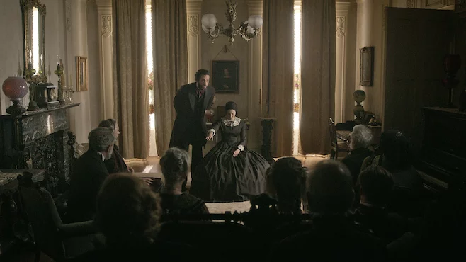

Alias Grace covers the story of Grace Marks, a Canadian Maid who in the 1800s was accused of murdering her employer and his head housekeeper with another servant.

The show is based on the novel of the same name by Margaret Atwood, also author of The Handmaid's Tale, and based on the writings of Susanna Moodie who was an author alive at the time of the trials. The conduit for the story a fictitious doctor, an early psychologist, conducting interviews with Grace trying to decide if she is fit to be released from prison.

Grace's life is annoyingly tragic. She is an immigrant traveling to Canada from Ireland. She has an emotionally and physically abusive father. Her family is poor. She has eleven siblings. She is a woman. All of this leads to her father sending her off to be a live-in maid in a wealthier home.

Despite her life's trajectory, Grace has a shining optimism while also suffering from gullibility. She meets Mary who is another live-in maid who quickly connects with her and they become close friends. Mary teaches her about the rebellion in Canada and tells her not to send all of her paycheck back to her father because he's an alcoholic and it wouldn't be used to help her siblings anyway. They play superstitious games to see who they will marry and spend the night talking.

Even though Mary is a fun, happy character she has several lines of dialogue that show she has probably learned some things the hard way. Mary doesn't want Grace to go outside at night to use the outhouse by herself because being alone at night as a woman is dangerous. She says things like "once you are found with a man in your room, you are the guilty one, no matter how they get it."

The consequence of being a woman in the time Grace Marks was alive is stressed through the story. Instead of being a murderer, Grace is famous for being a "murderess." The reason she even ends up in the home of those that she murders is because the son of her employer beats on her door at night trying to get in and she wants a way out. It's extraordinarily easy to feel sympathy for Grace.

The most enthralling thing about Alias Grace is the glimpses you see of different parts of Grace's personality. In the opening of the show, Grace says several things that people have called her and written her out to be. Innocent. Temptress. Demon. Most often Grace is calmly telling her story, but as a viewer it is impossible to nail down who she really is.

Alias Grace is a fantastic series and is definitely another win for Margaret Atwood.
